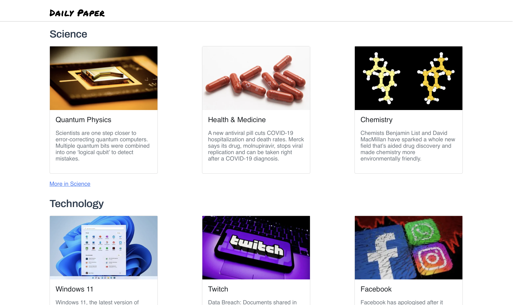
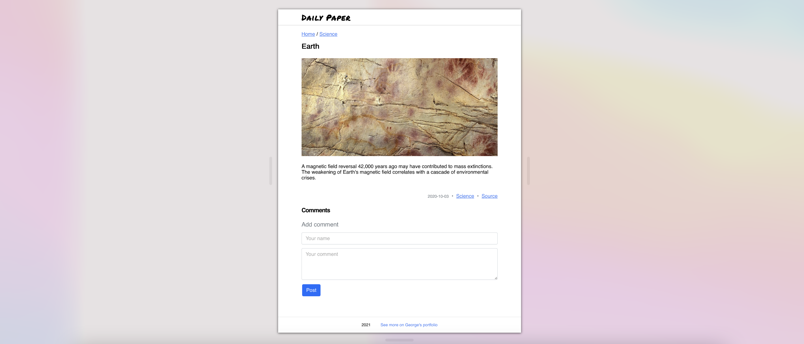
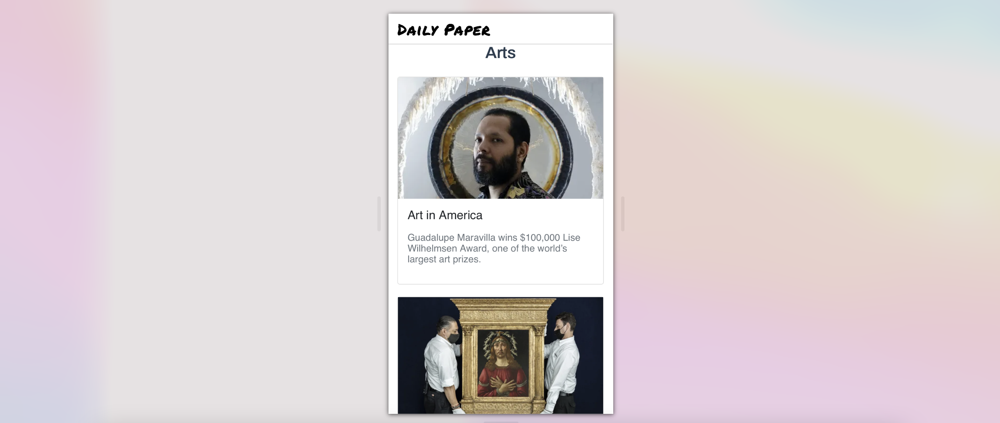

# Daily Paper

## Objectives
- Pre-rendering in web appplications
- Static site generation and Server-side rendering with Next.js
- Image optimization with lazy loading
- Client side state management with Redux
- CSS-in-JavaScript
## Features
> Daily Paper is a model of a news site. It contains news articles in three broad categories: Science- from [Science News](https://www.sciencenews.org/), Technology- from [BBC](https://www.bbc.com/news/technology), and Arts- from [Arts News](https://www.artnews.com/). The Home page displays a compact version of news from all three categories. Below each category are links to more news articles in the section.

> Clicking on any article forwards a user to the post with an option to add comments.

_Post page_

> Daily Paper is fully responsive and supports all screen sizes.

_Mobile View_

## Built With
- Next.js
- React
- Redux
- TypeScript
- Express
- Styled Components
- Yarn

## Getting Started
- Clone this project by running `git clone git@github.com:george-swift/daily-paper.git`
- Run `npm install` to install the required dependencies.
- After installing all dependencies, run `yarn dev` to fire up a local server with live reloading.
- If not already redirected, visit `http://localhost:3000/` in your browser to use _Daily Paper_
- To terminate the server, enter `Ctrl + C` in your terminal.

## Authors

👤 &nbsp; **Ubong George**
- LinkedIn: [Ubong George](https://www.linkedin.com/in/ubong-itok)
- Twitter: [@\_\_pragmaticdev](https://twitter.com/__pragmaticdev)
- GitHub: [@george-swift](https://github.com/george-swift)

## Acknowledgments

- [Next.js](https://nextjs.org/)
- [TypeScript](https://www.typescriptlang.org/)
- [React](https://reactjs.org/)
- [Redux](https://redux.js.org/introduction/getting-started)
- [Fullstack React with TypeScript](https://newline.co/discord/)

## Show your support

Leave a :star:️ &nbsp; if you like this project!

## License

Available as open source under the terms of the [MIT License](https://opensource.org/licenses/MIT).